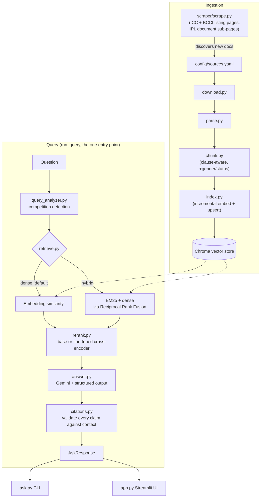
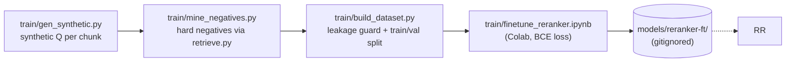

# ThirdUmpire

A question-answering assistant over cricket's official rule documents (MCC Laws of Cricket, ICC playing conditions, BCCI/IPL playing conditions), answering with grounded citations to the exact document, clause and page.

> **Status:** complete through Phase 7 (the plan's stopping point for a resume-ready project). Phases 8-9 (agentic retrieval, production hardening) are upgrades. See [PROJECT_PLAN.md](PROJECT_PLAN.md) for the full phase-by-phase build order and engineering conventions.

## The problem

Cricket is governed by a stack of overlapping rulebooks: the MCC Laws of Cricket are the base, but ICC and BCCI/IPL playing conditions override or extend them for their own competitions, and the same clause numbers mean different things in different documents. A question like *"In IPL, is the batter out if the ball hits a helmet lying on the field?"* needs the right document consulted first, with the Laws as fallback only where the competition-specific document is silent -- and a trustworthy answer needs an exact citation (document, clause, page) a user can go check themselves, not a plausible-sounding paraphrase.

ThirdUmpire is a retrieval-augmented QA system built around that: competition-aware retrieval, hybrid dense+lexical search, a reranker fine-tuned on this specific corpus, and citation validation that never silently drops an unverifiable claim.

## Architecture





## Setup (Windows / PowerShell)

```powershell
python -m venv .venv
.venv\Scripts\Activate.ps1
pip install -r requirements.txt
copy .env.example .env
# fill in GOOGLE_API_KEY and GEMINI_MODEL; optionally SYNTHETIC_GEMINI_MODEL
# (a separate, lighter model for train/gen_synthetic.py -- see "Known issues" below)
```

```powershell
python -m src.download          # fetch the non-manual source PDFs
# icc_mens_t20i_2025_07 requires a manual download: see its `url` note in
# config/sources.yaml, save the PDF to data/raw/icc_mens_t20i_2025_07.pdf
python -m src.ingest            # parse -> chunk -> index (builds chroma_db/)
python -m src.ask "In IPL, can a runner bat?"
streamlit run app.py            # interactive UI
```

Re-discover and ingest new documents from the ICC/BCCI/IPL listing pages (Phase 4):

```powershell
python -m scraper.scrape --apply
```

Run the eval harness against a hand-written golden set (never auto-generated -- see `eval/golden_template.jsonl` for the schema):

```powershell
python -m eval.run_eval --with-answers
```

## Documents

The rule documents (MCC, ICC, BCCI) are **not redistributed** in this repository -- `data/` and `chroma_db/` are gitignored. `config/sources.yaml` lists every source and whether it needs a manual download.

| doc_id | Competition | Gender | Type | Effective from |
|---|---|---|---|---|
| `mcc_laws_2026` | Laws of Cricket | all | laws | 2026-10-01 |
| `ipl_2026_pc` | IPL | all | playing_conditions | 2026-03-01 |
| `ipl_2026_coc` | IPL | all | code_of_conduct | 2026 |
| `icc_mens_t20i_2025_07` | ICC T20I | men | playing_conditions | 2025-07 |
| `icc_mens_test_2025_06` | ICC Test | men | playing_conditions | 2025-06 |
| `icc_mens_odi_2025_07` | ICC ODI | men | playing_conditions | 2025-07 |
| `icc_womens_test_2026_07` | ICC Test | women | playing_conditions | 2026-07 |
| `icc_womens_t20i_2026_07` | ICC T20I | women | playing_conditions | 2026-07 |
| `icc_womens_odi_2026_07` | ICC ODI | women | playing_conditions | 2026-07 |
| `bcci_mens_domestic_multiday_2025` | BCCI domestic multi-day (Ranji Trophy) | men | playing_conditions | 2025 |
| `bcci_mens_domestic_odi_2025` | BCCI domestic one-day (Vijay Hazare Trophy) | men | playing_conditions | 2025 |
| `bcci_mens_domestic_t20_2025` | BCCI domestic T20 (Syed Mushtaq Ali Trophy) | men | playing_conditions | 2025 |
| `bcci_womens_domestic_multiday_2025` | BCCI domestic multi-day | women | playing_conditions | 2025 |
| `bcci_womens_domestic_odi_2025` | BCCI domestic one-day | women | playing_conditions | 2025 |
| `bcci_womens_domestic_t20_2025` | BCCI domestic T20 | women | playing_conditions | 2025 |

15 documents, 9 competitions, ~6,000 indexed chunks.

## Evaluation results

All numbers below are from a single `python -m eval.run_eval` run against `eval/golden.jsonl` (48 hand-verified questions, 43 answerable -- 5 are deliberately unanswerable, to test that the system says so rather than guessing), with results and failure analysis saved under `eval/results/`.

| config | Recall@1 | Recall@5 | Recall@20 | MRR@10 | retrieve p50/p95 (s) | rerank p50/p95 (s) |
|---|---|---|---|---|---|---|
| dense (`DEFAULT_FIRST_STAGE`) | 0.814 | 0.884 | 0.977 | 0.854 | 0.074 / 0.105 | n/a |
| dense+base_rerank | 0.674 | 0.953 | 0.977 | 0.814 | 0.070 / 0.094 | 1.887 / 2.383 |
| hybrid (dense + BM25 via RRF) | 0.767 | 0.907 | 0.953 | 0.830 | 0.103 / 0.133 | n/a |
| hybrid+base_rerank | 0.651 | 0.930 | 0.953 | 0.790 | 0.105 / 0.158 | 1.562 / 2.015 |
| dense+ft_rerank | 0.651 | **0.977** | 0.977 | 0.804 | 0.060 / 0.093 | 1.636 / 2.148 |

Full results: `eval/results/20261002T051352Z.json` and its paired `_failures.csv`.

**First-stage decision (Phase 5):** `dense`, not `hybrid`. Dense wins on both Recall@20 (the reranker's input quality) and latency. The entire gap is the `conduct` question type (IPL Code of Conduct articles): BM25 actively hurts there, since neighbouring articles share near-identical boilerplate wording ("Note: Article N.N covers...") that lexically outscores the correct one. Hybrid search is fully built and available via `--first-stage hybrid` for anyone who wants it; it just isn't the default.

**Reranker fine-tuning (Phase 6):** base model `cross-encoder/ms-marco-MiniLM-L-6-v2`, trained in Colab on synthetic (query, passage, label) pairs generated from a representative 600-chunk subset of the corpus (full provenance in `train/data/dataset_info.json`: 1,238 synthetic questions, 21 dropped for leakage against the golden set, 1,086/131 train/val questions, 5,430/655 rows).

A first fine-tuning attempt made things measurably *worse* overall (MRR@10 0.597), and the honest root cause is documented rather than hidden: `train/gen_synthetic.py`'s competition-naming keyed only on `competition`, not `gender`, so questions generated from the *women's* BCCI domestic documents were still told to name the *men's*-only tournament ("the Ranji Trophy", etc.) -- training the model that either gender's document could answer such a question. 6 of 7 real failures were exactly that confusion. Fixed (gender-aware naming, ~120 affected chunks regenerated, retrained) and reflected in the table above: the fine-tuned reranker is now statistically tied with the base reranker overall (and has the best Recall@5 of any config), while being a clear, targeted win on the category it was built for:

| type (n) | dense+base_rerank MRR@10 | dense+ft_rerank MRR@10 |
|---|---|---|
| conduct (4) | 0.375 | **0.562** |
| format_dependent (5) | 0.900 | 0.900 |
| lookup (34) | 0.853 | 0.819 |

One Code of Conduct lookup (`g043`, Article 2.1) remains unsolved by every config -- not a regression, a genuinely hard case where neighbouring articles are nearly indistinguishable by both lexical and embedding similarity.

## Example Q&As

Both run live against the Streamlit UI (`dense` + base reranker, auto-detected competition):

> **Q: How many players are on each side in a cricket match?**
> Found · *Laws of Cricket*
> According to the MCC Laws of Cricket, a match is played between two sides of eleven players each, one of whom shall be captain. By agreement, a match may be played between sides of fewer than, or more than, eleven players, but not more than eleven players may field at any time.
> Citation: `mcc_laws_2026 | 1.1 | p.5`

> **Q: In the Ranji Trophy, by how many runs must the side batting first lead to enforce the follow-on?**
> Found · *BCCI domestic multi-day*
> According to the BCCI Playing Conditions for Men's Multi-day Matches, the side batting first must lead by at least 200 runs to require the other side to follow their innings. For matches of shorter duration, the minimum required leads are: 150 runs in a match of 3 or 4 days, 100 runs in a 2-day match, and 75 runs in a 1-day match.
> Citations: `bcci_mens_domestic_multiday_2025 | 14.1.1 | p.34`, `| 14.1.2 | p.34`

## Known issues and limitations

- **Comparison questions get coverage-aware context (fixed; only for the ICC/IPL formats).** Found via live use: "How does the minimum over rate differ between Test, ODI and T20I cricket?" came back "not found". Two causes: (1) `query_analyzer.py` used to restrict retrieval to whichever competition keyword it checked first, dropping the others; (2) even unfiltered, `CONTEXT_K=5` plus ~15 near-identical "Minimum Over Rates" chunks (one per competition x gender) meant the top 5 were all T20I/ODI variants and the Test chunk (reranked ~#12) never reached the model. Now `QueryPlan.compared_competitions` lists every format a question compares (a bare "Test" counts when another format is named next to it), `pipeline.top_up_compared()` fetches candidates for any compared format the main pass missed, and `pipeline.select_context()` guarantees each compared format its best-ranked chunk (men's/all unless the question says women's) before filling the rest by score. The question above now answers Test 15, ODI 14.28 (men) / 15.79 (women), T20I 14.11 / 16 overs per hour, with all citations valid. Limits: only the generic ICC/IPL format keywords trigger this (a domestic-trophy name still wins and filters to that one competition), and a comparison across more than `CONTEXT_K` formats can't fit every one. On the golden set's 4 comparison questions (g034-g037), both gold documents reached the 5-chunk context in 3 of 8 dense/hybrid runs before the fix and 8 of 8 after. The retrieval metrics above don't show this: `eval/run_eval.py` scores the ranked list directly and doesn't go through `select_context()`.
- **IPL Code of Conduct "Article N.N" lookups are the weakest category** across every config tested (see Evaluation results above) -- neighbouring articles share near-identical generic wording.
- **The fine-tuned reranker was trained on a 600-chunk subset, not the full ~6,000-chunk corpus.** Generating synthetic questions for the full corpus hit Gemini's free-tier daily quota (20 requests/day for the main model); `SYNTHETIC_GEMINI_MODEL` lets `train/gen_synthetic.py` use a separate, lighter model for this specifically, without affecting production answer quality.
- **At least one Law's full text didn't survive PDF extraction**: Law 4.1 (ball weight and size) is truncated mid-sentence in the parsed text, because the source PDF's values were in a table that didn't extract as plain text. A question about exact ball weight will get an incomplete or "not found" answer, not a wrong one -- citation validation still holds -- but it's a real parsing gap.
- **Some appendix-level content wasn't recognized as its own section** by the Phase 1 chunking regexes (e.g. the T20I Super Over appendix folds into the document's preamble chunk instead of its own clause), making it harder to retrieve precisely.
- **Corpus coverage is intentionally partial.** BCCI's "Standard" (ICC-mirrored) domestic documents, older MCC editions, WPL, and non-India boards' domestic competitions (Big Bash, CPL, SA20, The Hundred, ...) are out of scope for this build; questions about them correctly return "not found", not a hallucinated answer from an adjacent document.
- **No conversational/multi-turn support** -- every question is independent (Phase 8).
- **No production hardening** -- no caching, rate limiting, or auth; runs as a local CLI/Streamlit app only (Phase 9).
- **CPU-only in this environment.** Embedding and reranking run locally on CPU; the fine-tuned reranker was trained on a free Colab T4 GPU (~15-30 min), not locally.

## Future work (Phases 8-9, upgrades)

- **Phase 8:** a retrieval-quality gate using the fine-tuned reranker's score, triggering one grounded query rewrite and retry; conversational/multi-turn mode.
- **Phase 9:** FastAPI backend, a SQLite answer cache keyed on `INDEX_VERSION`, rate limiting, and a React frontend.
- Fine-tune on the full corpus once quota/budget allows, rather than the 600-chunk subset.
- Expand the corpus further: older MCC editions, WPL, additional ICC formats, and BCCI's "Standard" domestic documents (currently excluded to avoid confusion with the genuinely domestic tournaments).
- Fix the PDF-table and appendix-parsing gaps noted above.

## Development

Run modules as `python -m src.<module>` (e.g. `python -m src.ingest`, `python -m src.ask "question" [--competition ...] [--first-stage dense|hybrid] [--reranker base|ft] [--debug]`). See [PROJECT_PLAN.md](PROJECT_PLAN.md) for the phase-by-phase build order and engineering conventions. Run the test suite with `pytest`.
